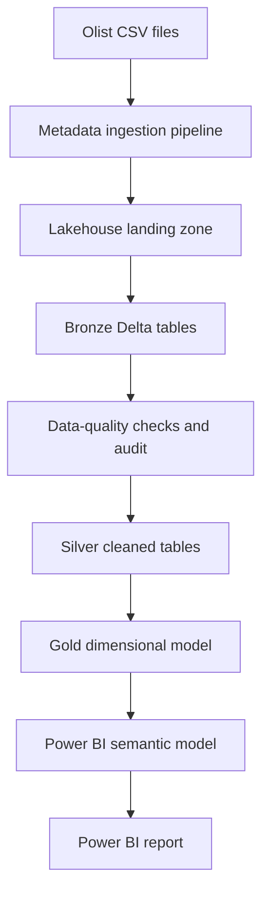
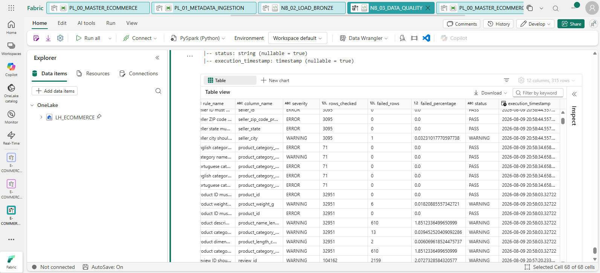
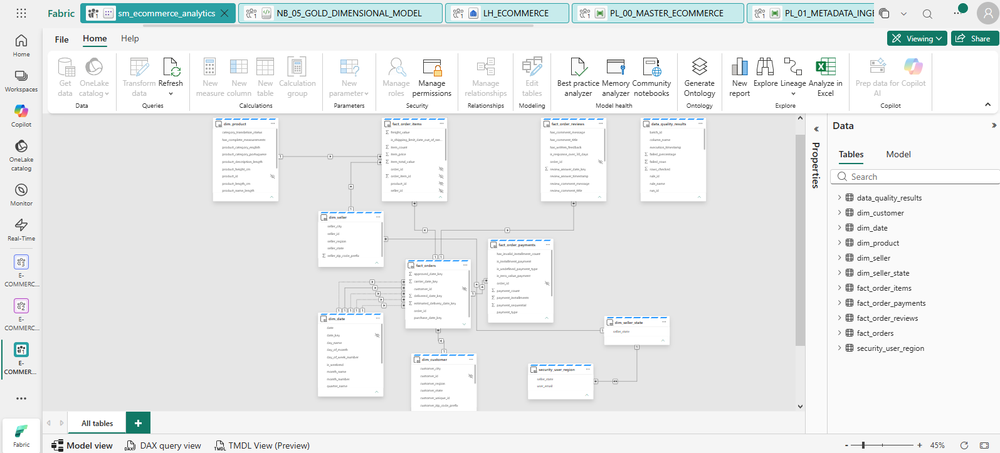
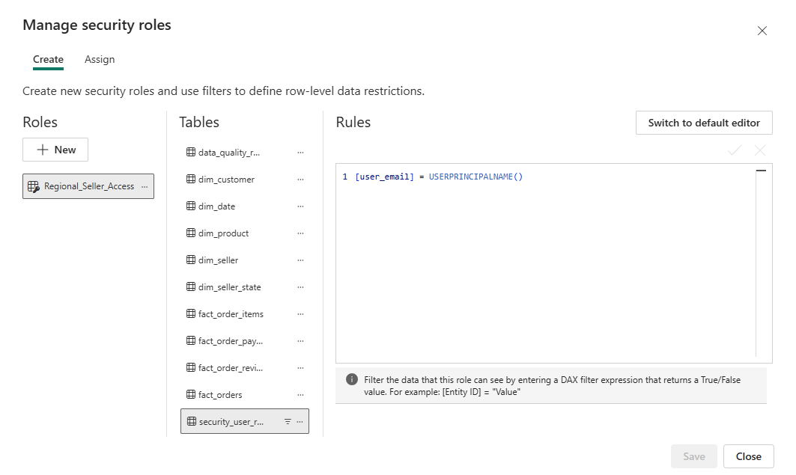
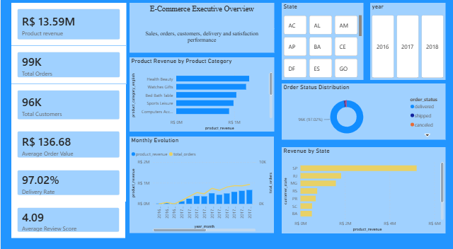

# End-to-End E-commerce Analytics in Microsoft Fabric

This is my first complete analytics engineering project in Microsoft Fabric. I built it because I wanted to understand what happens before a Power BI dashboard is ready: how files are ingested, how data quality is checked, how tables are cleaned, and how a dimensional model is prepared for reporting.

The project uses nine CSV files from the Brazilian Olist e-commerce dataset. The full process starts with metadata-driven ingestion and finishes with a refreshed Power BI semantic model. The main transformations are written in PySpark and the analytical tables are stored as Delta tables in a Fabric Lakehouse.

I kept the design intentionally understandable. The refresh is a full overwrite because the source dataset is static. If I changed this into a production solution, one of my next steps would be incremental ingestion and a more configurable security mapping.

## Project at a glance

| Item | Project value |
| --- | ---: |
| Source CSV files | 9 |
| Raw source rows | 1,550,922 |
| Fabric pipelines | 2 |
| PySpark notebooks | 4 |
| Bronze tables | 9 |
| Data-quality rules | 63 |
| Silver tables | 9 |
| Core Gold tables | 8 |
| Gold security helper tables | 2 |
| DAX measures in the backup | 49 |
| Power BI report pages | 8 |

The source data covers orders placed between September 2016 and October 2018. The largest file is geolocation, with 1,000,163 rows before cleaning.

## What I wanted to solve

The technical objective was to create one repeatable path from raw e-commerce files to a reporting model. The business objective was to make it possible to analyse:

- orders and order status;
- product revenue, freight cost and gross merchandise value;
- customer and seller distribution;
- delivery speed and late deliveries;
- payment methods and instalments;
- review scores and written feedback;
- the latest data-quality results.

I did not combine all transactional data into one large table. Order items, payments and reviews have different grains, so I kept them in separate fact tables. This avoids multiplying rows when an order has several items, several payment records or more than one review record.

## Architecture




*Workspace lineage at item level. It connects the Lakehouse, pipelines, notebooks, semantic model and Power BI report. I use this view mainly when I want to check dependencies or understand what could be affected by a change.*

The solution follows a medallion structure:

- **Bronze** keeps the source columns and adds ingestion metadata.
- **Silver** fixes data types, standardises text, removes invalid keys and deduplicates business records.
- **Gold** creates dimensions, fact tables, calculated delivery fields and validation outputs for Power BI.
- **Audit** stores rule results, rejected records and Gold-model validation results.


*The Lakehouse is split into Bronze, Silver, Gold and Audit schemas. Keeping these areas separate made it easier for me to understand where a table belongs and where a data problem first appeared.*

More detail is available in [Architecture and pipelines](docs/architecture-and-pipelines.md).

## Technology used

- Microsoft Fabric Data Factory pipelines
- Fabric Lakehouse and OneLake
- PySpark notebooks
- Delta tables
- Power BI semantic model
- DAX measures
- Dynamic row-level security support
- GitHub documentation in Markdown

## End-to-end orchestration

`PL_00_MASTER_ECOMMERCE` controls the complete refresh. It runs the following activities in order:

1. Invoke `PL_01_METADATA_INGESTION`.
2. Run `NB_02_LOAD_BRONZE`.
3. Run `NB_03_DATA_QUALITY`.
4. Run `NB_04_SILVER_TRANSFORMATION`.
5. Run `NB_05_GOLD_DIMENSIONAL_MODEL`.
6. Refresh the Power BI semantic model with transactional commit mode.


*The master pipeline keeps the refresh order visible in one place. Each green dependency means that the next activity starts only after the previous one succeeds.*

Every activity waits for the previous one to succeed. This means Silver is not rebuilt if the Bronze notebook fails, and the semantic model is not refreshed if the Gold notebook fails.

The ingestion pipeline reads `Files/config/ingestion_config.json`, loops through its entries sequentially and copies the configured files into the Lakehouse landing folders. I used a metadata-driven loop so that another file can be added through configuration instead of creating a separate Copy activity for every dataset.


*This run from 15 August 2026 completed all six activities successfully. The complete refresh took about 33 minutes, including file ingestion, all four notebooks and the semantic-model refresh. I kept this screenshot because it proves that the separate project components also work together as one flow.*

## Source data

| Dataset | Rows | Grain / business key | Important source detail |
| --- | ---: | --- | --- |
| Product category translation | 71 | One Portuguese category | English reporting labels |
| Sellers | 3,095 | One row per `seller_id` | City, state and ZIP prefix |
| Products | 32,951 | One row per `product_id` | 610 products have no category details |
| Order payments | 103,886 | `order_id` + `payment_sequential` | An order can have multiple payment records |
| Customers | 99,441 | One row per `customer_id` | 96,096 distinct `customer_unique_id` values |
| Order reviews | 99,224 | `review_id` + `order_id` | Review IDs can be reused; the compound key is unique |
| Order items | 112,650 | `order_id` + `order_item_id` | Product, seller, price and freight at item level |
| Orders | 99,441 | One row per `order_id` | Main order and delivery timestamps |
| Geolocation | 1,000,163 | Geographic observation | Contains 261,831 exact duplicate rows |

The complete field-level reference is in the [Data dictionary](docs/data-dictionary.md).

## Bronze layer

The Bronze notebook reads the landing files in permissive CSV mode and writes Delta tables with overwrite semantics. Raw business columns are kept close to the source and five audit columns are added:

| Audit column | Purpose |
| --- | --- |
| `_ingestion_timestamp` | Timestamp when the row entered Bronze |
| `_ingestion_date` | Ingestion calendar date |
| `_source_file` | Name of the original file |
| `_source_dataset` | Logical dataset name |
| `_batch_id` | UTC batch identifier shared by the load |

After the load, the notebook compares actual row counts with the expected counts, checks that the audit fields are populated and verifies that one batch identifier is present.

## Data quality and quarantine

The data-quality notebook contains 63 rules across the nine Bronze tables. The checks cover:

- missing and duplicate business keys;
- allowed statuses and state codes;
- relationships between orders, customers, products and sellers;
- valid prices, freight values, payment values and instalments;
- chronological order of purchase, approval, shipping and delivery dates;
- category translation coverage;
- review-score and response-date validity;
- coordinate validity, Brazilian boundaries and duplicate geolocation rows.

Each result is appended to `audit.data_quality_results`. A rule with no failed rows receives `PASS`. A failed warning-level rule receives `WARNING`, while a failed error-level rule receives `FAIL`.

Three types of rejected business records are also stored as JSON payloads in `audit.rejected_records`:

- delivered orders without a delivery date;
- credit-card payments without a valid number of instalments;
- geolocation coordinates outside the expected boundaries of Brazil.



*The notebook output shows the result at rule level: checked rows, failed rows, failure percentage, severity, status and execution time. The table contained 315 stored result rows when this screenshot was taken because Audit keeps execution history; the notebook itself defines 63 distinct rules.*

See [Data quality](docs/data-quality.md) for every rule and the audit schemas.

## Silver layer

The Silver notebook creates one cleaned table for every source dataset. The main work in this layer is:

- trimming identifiers and text;
- standardising city names to lowercase and state codes to uppercase;
- casting order dates to timestamps and review creation to a date;
- casting prices and payment values to `decimal(12,2)`;
- validating positive keys and non-negative financial values;
- replacing missing product categories with `unknown`;
- renaming `product_name_lenght` and `product_description_lenght` to the correct spelling;
- removing duplicate rows by the correct simple or compound business key;
- checking referential integrity after all tables are written.

Geolocation is the table where deduplication has the largest effect. Exact geographic observations are removed using ZIP prefix, latitude, longitude, city and state together.

## Gold dimensional model

The main analytical model contains four dimensions and four fact tables.

| Gold table | Grain | Primary key |
| --- | --- | --- |
| `dim_date` | One row per calendar date | `date_key` |
| `dim_customer` | One row per order-level customer record | `customer_id` |
| `dim_product` | One row per product | `product_id` |
| `dim_seller` | One row per seller | `seller_id` |
| `fact_orders` | One row per order | `order_id` |
| `fact_order_items` | One row per item inside an order | `order_id` + `order_item_id` |
| `fact_order_payments` | One row per payment sequence | `order_id` + `payment_sequential` |
| `fact_order_reviews` | One row per review-order combination | `review_id` + `order_id` |

Two helper tables support security:

- `dim_seller_state` contains the distinct seller states;
- `security_user_region` maps a user account to an allowed seller state.



*The implemented semantic model keeps Orders, Items, Payments and Reviews at their own grains. Shared dimensions filter the facts through one-to-many relationships, while the two small security tables provide the seller-state path used for RLS.*

The Gold notebook validates keys, relationships, date keys and Silver-to-Gold row counts. It saves these checks in five audit tables so that the model build can be reviewed after execution.

See [Data dictionary](docs/data-dictionary.md) and [Semantic model and DAX](docs/semantic-model-and-dax.md).

## Business calculations

The Gold tables already contain useful row-level fields before DAX is applied. Examples include:

- approval time in hours;
- purchase-to-carrier days;
- shipping days and total delivery days;
- delivery variance compared with the estimated date;
- on-time/late classification and timeline-anomaly flags;
- item total value including freight;
- instalment and zero-value payment flags;
- positive, neutral and negative review classification;
- written-feedback flags and review response days;
- Brazilian customer and seller regions.

The semantic-model backup contains 49 DAX measures. They cover orders, revenue, freight, customers, sellers, delivery, payments, reviews, time comparisons and the latest data-quality execution.

## Security approach

The notebook prepares a dynamic RLS mapping by user email and seller state. In the semantic model, the intended role filter is based on `USERPRINCIPALNAME()` and the selected state is propagated through the seller-state and seller tables to order items.



*The `Regional_Seller_Access` role filters `security_user_region` by the signed-in account. The relationship path then limits seller-state data without writing a separate role for every user.*

The repository version should never contain a real personal email. The example mapping in the documentation uses `analyst@example.com`; environment-specific users should be maintained outside the public notebook or injected through configuration.

## Power BI report

The report contains eight pages in the following order:

1. Executive Overview;
2. Sales Performance;
3. Customer Analytics;
4. Product & Category;
5. Seller Performance;
6. Delivery & Logistics;
7. Customer Satisfaction;
8. Order Details.



*The opening page brings together product revenue, orders, customers, average order value, delivery rate and review score. The remaining pages separate these subjects and the final Order Details page provides row-level inspection.*

The complete page-by-page explanation is available in [Power BI report documentation](docs/power-bi-report.md).

## Repository structure

```text
ecommerce-fabric-analytics/
├── README.md
├── data/
│   └── README.md
├── notebooks/
│   ├── NB_02_LOAD_BRONZE.py
│   ├── NB_03_DATA_QUALITY.py
│   ├── NB_04_SILVER_TRANSFORMATION.py
│   └── NB_05_GOLD_DIMENSIONAL_MODEL.py
├── pipelines/
│   ├── PL_00_MASTER_ECOMMERCE.json
│   └── PL_01_METADATA_INGESTION.json
├── semantic-model/
│   └── Ecommerce_DAX_Measures_Backup.xlsx
├── images/
│   ├── architecture/
│   │   ├── audit-validation-tables.png
│   │   ├── bronze-layer-tables.png
│   │   ├── gold-layer-tables.png
│   │   ├── lakehouse-medallion-schemas.png
│   │   ├── silver-layer-tables.png
│   │   └── workspace-lineage.png
│   ├── data-quality/
│   │   └── data-quality-results.png
│   ├── pipeline/
│   │   ├── master-orchestration-pipeline.png
│   │   ├── metadata-driven-ingestion.png
│   │   └── successful-end-to-end-run.png
│   ├── semantic-model/
│   │   ├── dynamic-rls-role.png
│   │   ├── model-overview.png
│   │   └── relationships.png
│   └── report/
│       ├── 01-executive-overview.png
│       ├── 02-sales-performance.png
│       ├── 03-customer-analytics.png
│       ├── 04-product-and-category.png
│       ├── 05-seller-performance.png
│       ├── 06-delivery-and-logistics.png
│       ├── 07-customer-satisfaction.png
│       ├── 08-order-details.png
│       └── product-category-tooltip.png
└── docs/
    ├── architecture-and-pipelines.md
    ├── data-dictionary.md
    ├── data-quality.md
    ├── semantic-model-and-dax.md
    ├── setup-and-runbook.md
    ├── power-bi-report.md
    └── lessons-and-improvements.md
```

I recommend keeping the full raw CSV files outside the public repository and adding either a small sample or a `data/README.md` that explains where the data comes from. This keeps the repository easier to clone and avoids redistributing a dataset without checking its terms.

## How to run the project

At a high level:

1. Create a Fabric Lakehouse and add the source and configuration folders.
2. Add `ingestion_config.json` under `Files/config`.
3. Import the two pipelines and reconnect their Lakehouse, notebook and semantic-model references.
4. Import the four notebooks and attach them to the Lakehouse.
5. Replace the public security placeholder with an approved configuration source.
6. Run `PL_00_MASTER_ECOMMERCE`.
7. Review the audit tables before opening the report.
8. Configure the semantic-model relationships and DAX measures.
9. Configure and test RLS with representative users.
10. Refresh and validate the Power BI report.

Detailed instructions and validation queries are in the [Setup and runbook](docs/setup-and-runbook.md).

## What I learned

The hardest part was not writing one individual transformation. It was keeping the grain, keys and relationships consistent from one layer to the next. I also learned that a notebook can finish successfully even when a data-quality rule returns `FAIL`; if quality failures should stop the pipeline, that behaviour has to be added explicitly.

I used a simple full-refresh approach and repeated some validation code because I wanted to see every step while learning. The project works as a portfolio project, but I also documented the parts I would refactor before calling it production-ready.

See [Lessons and improvements](docs/lessons-and-improvements.md).

## Documentation index

- [Architecture and pipelines](docs/architecture-and-pipelines.md)
- [Data dictionary](docs/data-dictionary.md)
- [Data quality](docs/data-quality.md)
- [Semantic model and DAX](docs/semantic-model-and-dax.md)
- [Setup and runbook](docs/setup-and-runbook.md)
- [Power BI report documentation](docs/power-bi-report.md)
- [Lessons and improvements](docs/lessons-and-improvements.md)
- [GitHub upload checklist](GITHUB_UPLOAD_CHECKLIST.md)

## Notes before publishing

- Remove or replace personal email addresses from security mapping code.
- Rebind Fabric workspace, Lakehouse, notebook, connection and semantic-model identifiers after import.
- The visual documentation is complete. A future `Test as role` screenshot would provide stronger proof of the RLS result, while the current screenshot documents the role definition.
- Decide whether the Power BI file and full raw data should be stored directly, through large-file storage, or linked externally.
- Choose a licence only after checking the dataset terms and deciding how others may reuse the project code.
