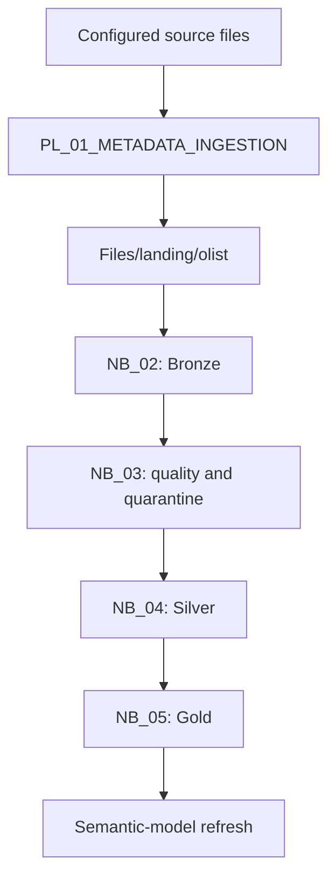
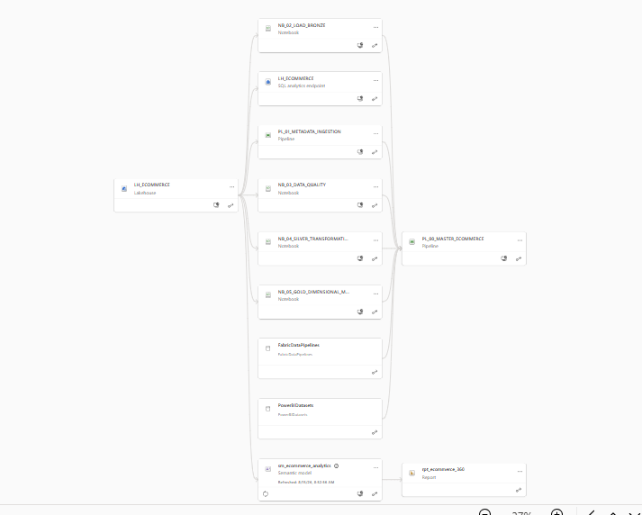
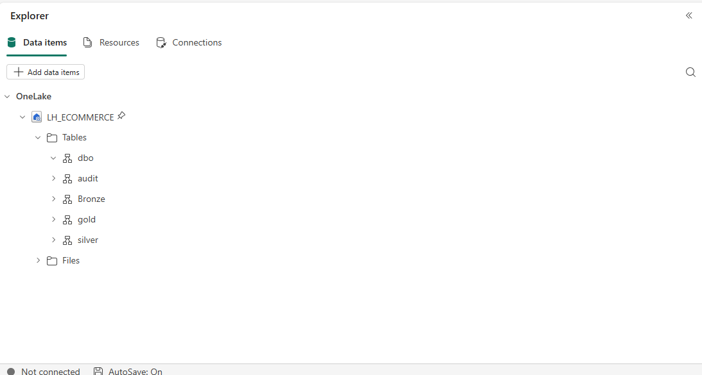
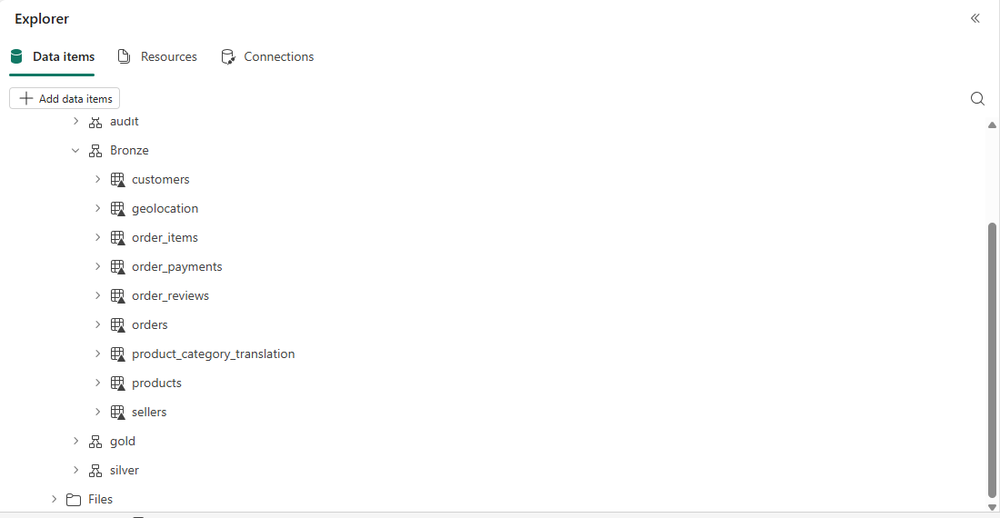
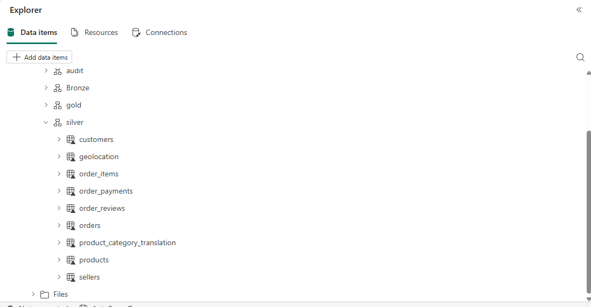
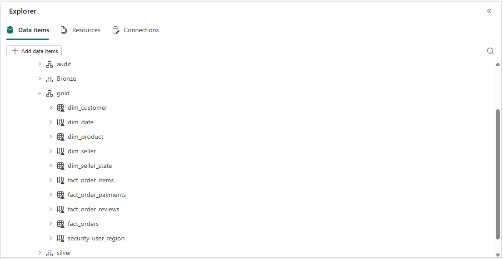
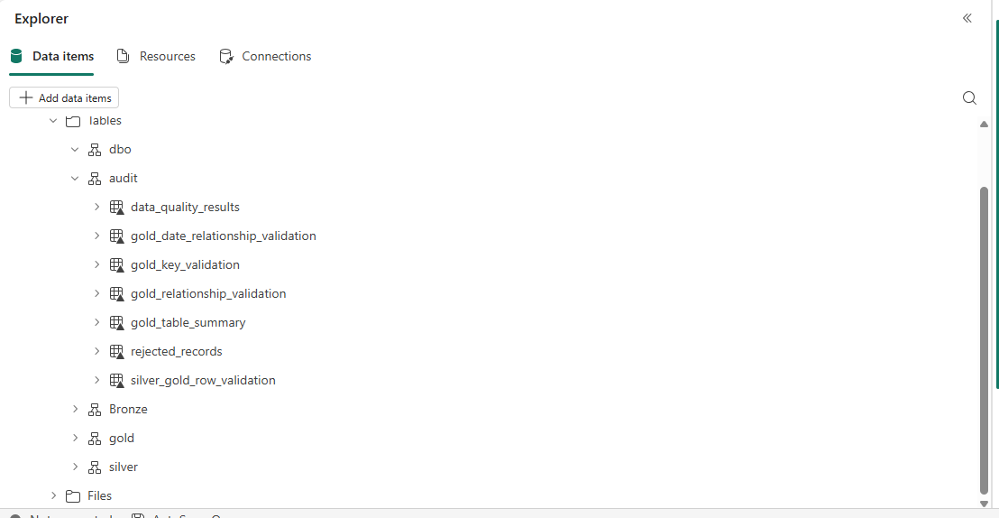
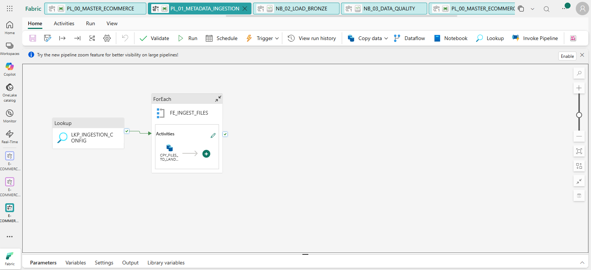
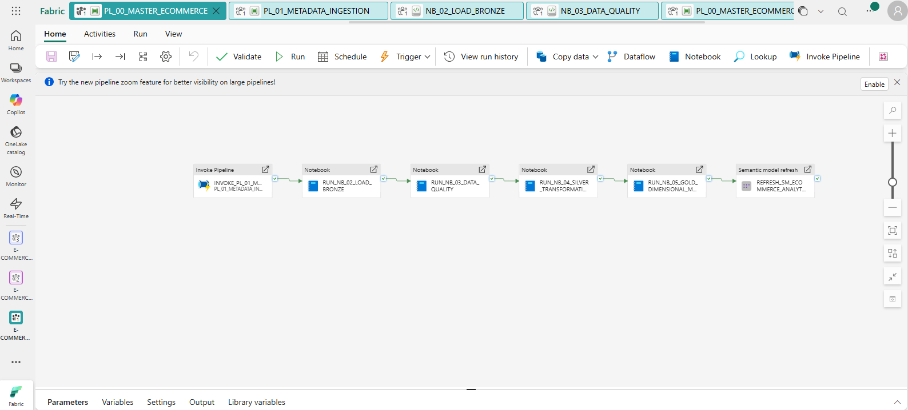
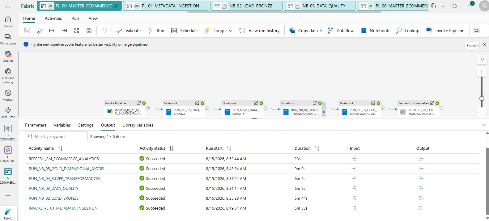

# Architecture and pipelines

## Why I used this structure

I wanted the project to show more than a finished dashboard. The architecture separates ingestion, validation, cleaning and modelling so that a problem can be traced back to the correct stage.

For example, a missing delivery date is first detected in Bronze by a data-quality rule. The raw record can be stored in quarantine, while Silver still has a clear set of cleaning rules and Gold remains focused on reporting fields. This separation made the project easier for me to understand and debug.

## Data flow





*The Fabric lineage view shows the relationships between the Lakehouse, SQL analytics endpoint, pipelines, notebooks, semantic model and report. This is item-level lineage, so it is useful for impact analysis, but it does not replace column-level transformation documentation.*

## Lakehouse areas

| Area | Example path or schema | Purpose |
| --- | --- | --- |
| Configuration | `Files/config/ingestion_config.json` | List of files and target folders used by the ingestion pipeline |
| Source file area | Defined by `source_folder` in the configuration | Location from which the Copy activity reads |
| Landing | `Files/landing/olist/<dataset>` | Stable input path used by the Bronze notebook |
| Bronze | `bronze.*` | Raw Delta tables plus ingestion metadata |
| Audit | `audit.*` | Rule outcomes, rejected records and model validation |
| Silver | `silver.*` | Cleaned and typed business tables |
| Gold | `gold.*` | Dimensions, facts and security helper tables |



*The Lakehouse Explorer confirms the four schemas used in the implementation: Audit, Bronze, Silver and Gold. The `dbo` schema is also visible because it is created by default in the SQL analytics endpoint.*



*Bronze contains one source-aligned Delta table for each of the nine input datasets. The table names are shorter than the original CSV file names, but the data is still kept close to its source shape at this stage.*



*Silver also contains nine source-aligned tables. At this point, identifiers and text have been standardised, business fields have useful data types and duplicates or invalid records have been handled by explicit transformation rules.*



*Gold contains four dimensions, four fact tables and two security helpers. I kept the four facts separate because orders, items, payments and reviews have different grains.*



*Audit stores both the data-quality history and the checks created after the Gold model is built. This gives me a place to review rejected rows, key problems, relationship problems and Silver-to-Gold row-count differences without mixing them with reporting tables.*

## Pipeline 1: `PL_01_METADATA_INGESTION`

This pipeline handles file movement into the landing zone.

### Activity sequence

| Order | Activity | Type | What it does |
| ---: | --- | --- | --- |
| 1 | `LKP_INGESTION_CONFIG` | Lookup | Reads `Files/config/ingestion_config.json` from the Lakehouse |
| 2 | `FE_INGEST_FILES` | ForEach | Loops through the configuration rows sequentially |
| 3 | `CPY_FILES_TO_LANDING` | Copy | Copies one configured binary file to its destination folder |



*The pipeline first reads the configuration with a Lookup activity. The ForEach activity then executes the same Copy logic for every configured file. This was my first practical use of metadata-driven ingestion and helped me avoid building nine almost identical Copy activities.*

The ForEach activity uses this expression:

```text
@activity('LKP_INGESTION_CONFIG').output.value
```

The Copy activity reads these metadata properties:

| Property | Used as |
| --- | --- |
| `source_file` | Source and destination file name |
| `source_folder` | Input folder in the Lakehouse Files area |
| `destination_folder` | Landing folder in the Lakehouse Files area |

Data-consistency validation is enabled on the Copy activity. The loop is sequential, which is slower than parallel loading but easier to monitor while learning and safe for the small number of source files in this project.

### Example configuration shape

The exact configuration file was not included in the exported sources, but the pipeline requires an array with the following shape:

```json
[
  {
    "source_file": "olist_customers_dataset.csv",
    "source_folder": "source/olist",
    "destination_folder": "landing/olist/customers"
  }
]
```

The remaining files follow the same pattern, with landing folders matching the folder names expected by the Bronze notebook.

## Pipeline 2: `PL_00_MASTER_ECOMMERCE`

This is the orchestration pipeline for the project.

| Order | Activity | Fabric type | Dependency |
| ---: | --- | --- | --- |
| 1 | `INVOKE_PL_01_METADATA_INGESTION` | Invoke Pipeline | None |
| 2 | `RUN_NB_02_LOAD_BRONZE` | Notebook | Ingestion succeeded |
| 3 | `RUN_NB_03_DATA_QUALITY` | Notebook | Bronze succeeded |
| 4 | `RUN_NB_04_SILVER_TRANSFORMATION` | Notebook | Data quality notebook succeeded |
| 5 | `RUN_NB_05_GOLD_DIMENSIONAL_MODEL` | Notebook | Silver succeeded |
| 6 | `REFRESH_SM_ECOMMERCE_ANALYTICS` | Semantic Model Refresh | Gold succeeded |



*The master pipeline puts the complete dependency chain in one place. The order is important because each layer uses the output of the previous one.*

All activities use a 12-hour timeout, no automatic retry and a 30-second retry interval setting. The semantic-model refresh waits for completion and uses transactional commit mode.



*A successful run on 15 August 2026. The individual durations were about 5 minutes 33 seconds for ingestion, 5 minutes 44 seconds for Bronze, 6 minutes 9 seconds for data quality, 6 minutes 9 seconds for Silver, 9 minutes 9 seconds for Gold and 23 seconds for the semantic-model refresh. The full sequence finished in about 33 minutes.*

### Important behaviour

The notebook dependency is based on notebook execution status, not on the values written to `audit.data_quality_results`. A failed rule does not automatically fail `NB_03_DATA_QUALITY`. In the current design, the pipeline can continue when rule results contain `FAIL`.

For a production version, I would add a final gate to the data-quality notebook:

1. Count error-severity results with `status = 'FAIL'` for the current execution.
2. Write a clear summary to Audit.
3. Raise a notebook exception when the accepted threshold is exceeded.
4. Allow the master pipeline to stop before Silver.

## Notebook responsibilities

### `NB_02_LOAD_BRONZE`

- Lists files from `Files/landing/olist`.
- Generates a UTC batch identifier.
- Reads CSV data in permissive mode.
- Uses special multiline CSV settings for review comments.
- Adds five audit columns.
- Writes Bronze Delta tables in overwrite mode.
- Validates row counts, audit completeness and batch count.

### `NB_03_DATA_QUALITY`

- Creates Audit tables when they do not exist.
- Runs 63 source-specific rules.
- Records rows checked, failed rows, percentage, severity and status.
- Appends results so execution history is kept.
- Stores selected rejected records with the full source row as JSON.

### `NB_04_SILVER_TRANSFORMATION`

- Creates the Silver schema.
- Cleans and writes nine source-aligned tables.
- Uses correct timestamp, integer, double and decimal types.
- Deduplicates simple and compound business keys.
- Checks foreign-key coverage between Silver tables.
- Checks translation and geolocation coverage.

### `NB_05_GOLD_DIMENSIONAL_MODEL`

- Creates the calendar dimension dynamically from order dates.
- Creates customer, product and seller dimensions.
- Creates four fact tables at separate grains.
- Adds reporting classifications and additive count columns.
- Validates primary keys, relationships and date keys.
- Reconciles Silver and Gold row counts.
- Saves model-validation results to Audit.
- Creates state and user-state tables for dynamic RLS.

## Refresh approach

The current project uses full refreshes:

- Bronze tables are overwritten.
- Silver tables are overwritten.
- Gold tables and Gold validation summaries are overwritten.
- `audit.data_quality_results` and `audit.rejected_records` are appended.

This is a reasonable first design for a static learning dataset. For a changing source, I would introduce watermark columns, idempotent batch handling and Delta `MERGE` operations. Audit would then record both the source batch and the pipeline execution ID.

## Environment-specific references

The exported pipeline JSON contains workspace, Lakehouse, notebook, connection and semantic-model identifiers from the original Fabric environment. They are not portable by themselves. After import into another workspace, every reference must be reconnected before the pipeline is run.

For a public repository, I would either replace these identifiers with clear placeholders or explain that the JSON is an export that requires rebinding.
