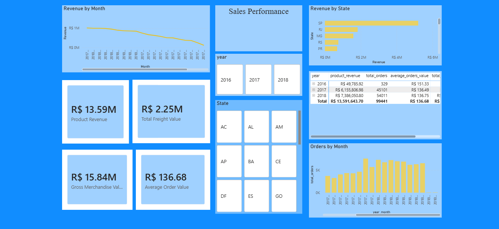
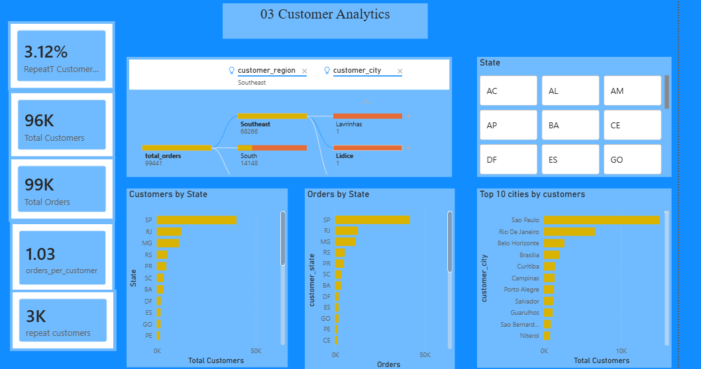
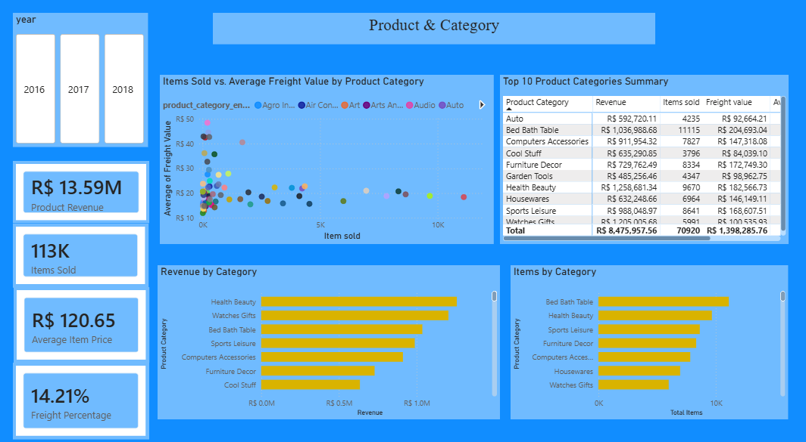
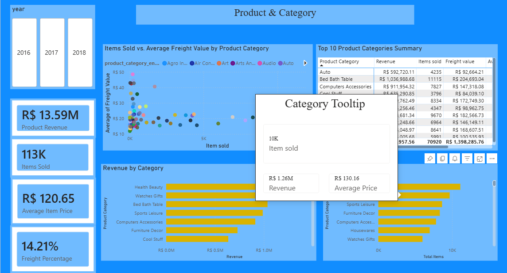
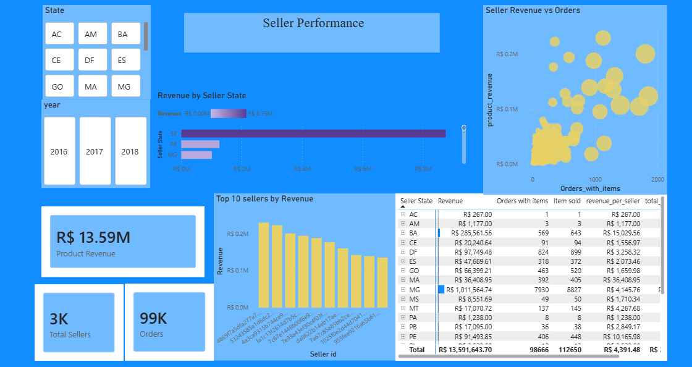
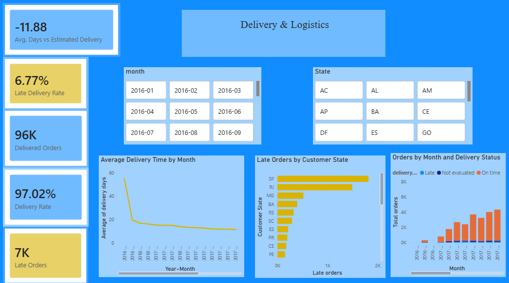
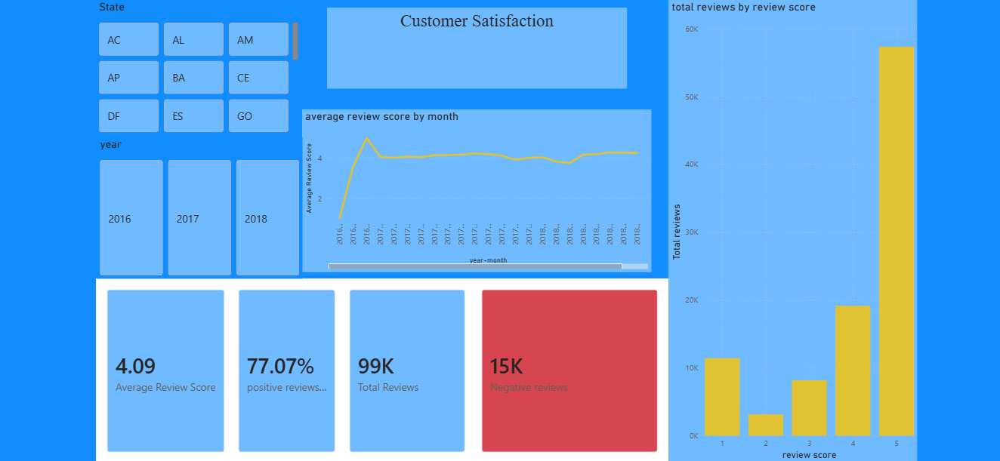
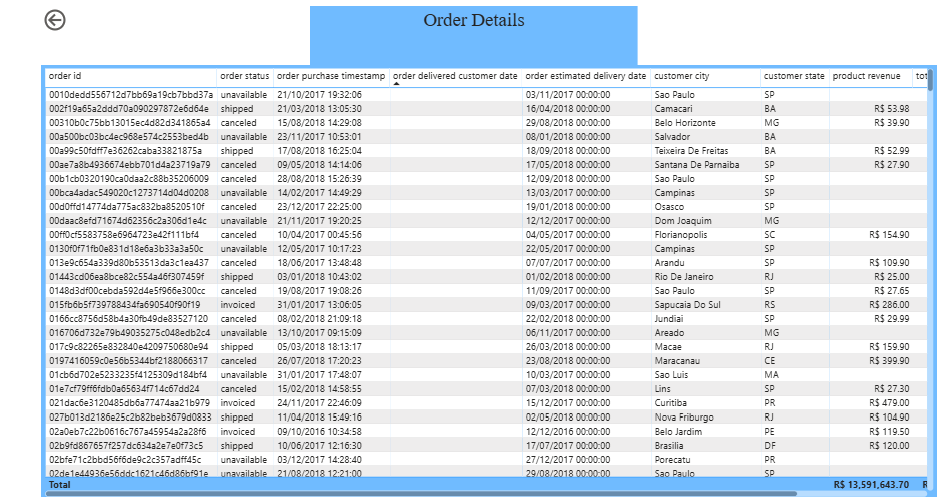

# Power BI report documentation

## Report status

The report is documented through screenshots of all eight pages. The screenshots are enough to describe the page order, visible KPIs, filters and main visuals. The PBIX file is not part of this package, so settings such as visual interactions, drill-through fields and hidden filters cannot be checked directly.

I kept `Order Details` as the last page because it is the lowest level of analysis. The report starts with a general overview, moves through the main business areas and finishes with individual order records.

## Page order

| Page | Report page | Main purpose |
| ---: | --- | --- |
| 1 | Executive Overview | Overall sales, orders, customers, delivery and satisfaction |
| 2 | Sales Performance | Revenue, freight, GMV, average order value and monthly sales |
| 3 | Customer Analytics | Customer distribution, repeat behaviour and orders per customer |
| 4 | Product & Category | Category revenue, items sold, freight and average item price |
| 5 | Seller Performance | Seller contribution, seller states and revenue concentration |
| 6 | Delivery & Logistics | Delivery rate, late orders and delivery-time trends |
| 7 | Customer Satisfaction | Review score, positive reviews and negative reviews |
| 8 | Order Details | Row-level order inspection |

The Product & Category page also has a report-page tooltip. The tooltip is an interaction belonging to page 4, not a separate dashboard page.

## 1. Executive Overview

This is the starting page of the report. It combines the most important metrics from several areas so a reader can understand the scale and general performance of the dataset before opening a more detailed page.

Visible KPIs:

- **R$ 13.59M** product revenue;
- **99K** orders;
- **96K** customers;
- **R$ 136.68** average order value;
- **97.02%** delivery rate;
- **4.09** average review score.

The page also contains product revenue by category, monthly revenue and order evolution, order-status distribution and revenue by customer state. State and year slicers provide the main navigation filters. São Paulo is clearly the largest state by revenue, while delivered orders represent the large majority of the order-status chart.

## 2. Sales Performance

This page separates the main financial metrics from the general overview and adds more time and geographic detail.

Visible KPIs:

- **R$ 13.59M** product revenue;
- **R$ 2.25M** freight value;
- **R$ 15.84M** gross merchandise value;
- **R$ 136.68** average order value.

The page compares revenue and orders by month, shows revenue by state and includes a yearly table. The yearly values visible in the table are:

| Year | Product revenue | Orders | Average order value |
| ---: | ---: | ---: | ---: |
| 2016 | R$ 49,785.92 | 329 | R$ 151.33 |
| 2017 | R$ 6,155,806.98 | 45,101 | R$ 136.49 |
| 2018 | R$ 7,386,050.80 | 54,011 | R$ 136.75 |
| **Total** | **R$ 13,591,643.70** | **99,441** | **R$ 136.68** |

The small 2016 value should be read together with the source coverage: the dataset only starts in September 2016, so it is not a complete calendar year. State and year slicers can be used to compare geographic and annual performance.

## 3. Customer Analytics

This page focuses on customer volume, repeat behaviour and geographic distribution.

Visible KPIs:

- **96K** total customers;
- **99K** total orders;
- **1.03** orders per customer;
- **3K** repeat customers;
- **3.12%** repeat-customer rate.

The decomposition tree starts from total orders and allows investigation by customer region and city. In the captured view, the Southeast region contains 68,266 orders and the South contains 14,148. The bar charts compare customers and orders by state, while the city chart shows São Paulo as the largest customer city.

The low repeat-customer rate is an important business observation. Most customer identities appear only once in the available period, so retention would be a useful area for a future cohort analysis.

## 4. Product & Category

This page compares category revenue, sales volume, freight and average item value.

Visible KPIs:

- **R$ 13.59M** product revenue;
- **113K** items sold;
- **R$ 120.65** average item price;
- **14.21%** freight percentage.

The scatter chart compares items sold with average freight value by product category. The two lower bar charts show that the categories with the most revenue are not always in exactly the same order as the categories with the most items. Health & Beauty leads revenue in the captured view, while Bed Bath Table leads item volume.

The Top 10 table shows a combined **R$ 8,475,957.56** in revenue, **70,920** sold items and **R$ 1,398,285.76** in freight for the displayed categories.

### Category tooltip

The report-page tooltip adds context without forcing the user to leave the category page. In the captured example it shows approximately **10K** items sold, **R$ 1.26M** revenue and an average price of **R$ 130.16** for the hovered category.

## 5. Seller Performance

This page shows how revenue and item volume are distributed across sellers and seller states.

Visible KPIs include approximately **3K sellers**, **99K orders** and **R$ 13.59M** product revenue. The state chart shows a strong concentration in São Paulo, which is expected from the seller distribution in this dataset.

The scatter chart compares seller revenue with orders containing items. This makes it easier to distinguish high-volume sellers from sellers with a higher value per order. The page also contains a Top 10 seller chart and a detail table with revenue, orders with items, items sold and revenue per seller.

This page is the most relevant report area for the seller-state RLS path. When RLS is tested, the state slicer, seller visuals and totals should all reduce to the states assigned to the signed-in user.

## 6. Delivery & Logistics

This page focuses on delivery speed and late-order behaviour.

Visible KPIs:

- **97.02%** delivery rate;
- **96K** delivered orders;
- **7K** late orders;
- **6.77%** late-delivery rate;
- **-11.88 days** average difference from the estimated delivery date.

The negative delivery variance means that, on average, delivered orders arrived around 11.88 days earlier than the estimated date. The monthly trend shows a very high value at the beginning of the dataset and then a more stable delivery duration. Because the first months contain much less data, they should not be interpreted in the same way as the complete periods.

The state chart shows that São Paulo has the largest absolute number of late orders. This should not automatically be read as the worst late-delivery performance because São Paulo also has the largest total order volume. A rate by state would be useful when comparing service quality fairly.

## 7. Customer Satisfaction

This page documents review volume and satisfaction.

Visible KPIs:

- **4.09** average review score;
- **77.07%** positive-review rate;
- **99K** total reviews;
- **15K** negative reviews.

The score distribution is strongly concentrated at 5, followed by score 4. Scores 1 and 2 form the negative-review group used by the negative-review measures. The monthly average remains close to 4 for most of the complete reporting period, although the earliest months move more sharply because they contain fewer records.

State and year slicers allow satisfaction to be compared across geography and time. A future extension could connect negative reviews with delivery delays, seller state or product category to investigate likely causes.

## 8. Order Details

`Order Details` is intentionally the final page. It is a row-level inspection page rather than a summary dashboard and is useful after a user has already identified an area of interest on one of the analytical pages.

The table displays order ID, status, purchase timestamp, delivered date, estimated delivery date, customer city, customer state and product revenue. The total product revenue visible in the screenshot is **R$ 13,591,643.70**.

The back button suggests that this page is designed for drill-through or navigation from another report page. The screenshot does not show the originating selection, so the exact drill-through configuration should still be checked in the PBIX file. The table is wider than the available canvas and uses a horizontal scroll bar; reducing the number of visible columns or grouping fields into a tooltip would make the page easier to use.

## Report navigation and consistency

The page order follows a simple analytical path:

1. start with the overall business position;
2. review sales performance;
3. understand customers;
4. analyse products and categories;
5. compare sellers;
6. investigate delivery performance;
7. review customer satisfaction;
8. open individual order details.

The report uses a consistent blue background, pale-blue visual containers and yellow as the main chart colour. Year and state slicers appear on several pages, which makes the navigation familiar. Before public presentation, the main visual improvement I would make is to standardise font sizes and replace the lower-resolution Executive Overview capture with a larger export if one is available.

## Files still useful but not required for the screenshots

The visual documentation is complete. The following files would make the repository easier to reproduce, but they are separate from the screenshot set:

- the PBIX or PBIP project;
- a TMDL export of the semantic model;
- a screenshot of `Test as role` for the dynamic RLS role;
- a short list of configured drill-through fields and page-navigation actions.
