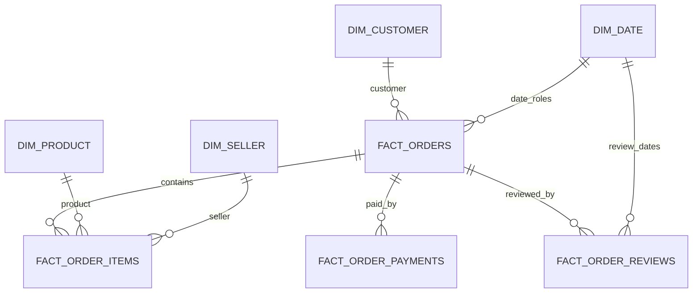
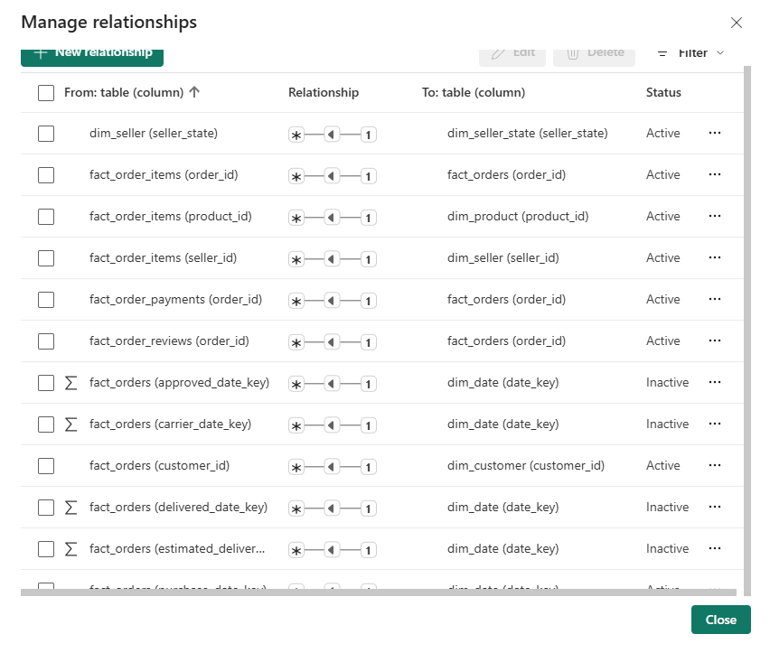

# Semantic model and DAX

## Scope of this document

The project contains the Gold notebook, an Excel backup of 49 DAX measures and screenshots of the implemented semantic model. It still does not contain a semantic-model definition file such as TMDL or BIM, so the screenshots document the visible structure while the notebook and DAX backup explain the intended keys and date roles.

For a more portable repository, I would still export the model definition. A screenshot proves how the model looked in the original workspace, but TMDL would make relationships, measures, formats and roles easier to review or recreate.

## Model shape




*The Model view shows the four fact tables, shared dimensions, data-quality results and the two RLS helper tables. I arranged the tables by role so the main filter paths remain visible even though the model has more than one fact grain.*

This is a constellation rather than a single classic star. `fact_orders` is the parent of three lower-grain facts. I used this approach because orders, items, payments and reviews do not share the same grain.

## Main relationships

| From the one side | To the many side | Key | Expected state |
| --- | --- | --- | --- |
| `dim_customer` | `fact_orders` | `customer_id` | Active |
| `dim_product` | `fact_order_items` | `product_id` | Active |
| `dim_seller` | `fact_order_items` | `seller_id` | Active |
| `fact_orders` | `fact_order_items` | `order_id` | Active |
| `fact_orders` | `fact_order_payments` | `order_id` | Active |
| `fact_orders` | `fact_order_reviews` | `order_id` | Active |

Single-direction filtering from the one side to the many side is the safest default. Bidirectional filtering should be used only when a specific report or RLS path requires it and has been tested for ambiguity.



*The relationship list confirms the active many-to-one paths between the facts and their parent tables. It also shows that the additional order-date relationships are inactive, which is expected for role-playing dates used through `USERELATIONSHIP`.*

## Date relationships

`fact_orders` contains five role-playing date keys. Only one relationship between `dim_date` and the same fact table can be active without ambiguity.

| Fact field | Business role | Relationship use |
| --- | --- | --- |
| `purchase_date_key` | Purchase date | Recommended active relationship |
| `approved_date_key` | Approval date | Inactive, activated by measure |
| `carrier_date_key` | Carrier handover date | Inactive, activated by measure |
| `delivered_date_key` | Customer delivery date | Inactive, activated by measure |
| `estimated_delivery_date_key` | Estimated delivery date | Inactive, activated by measure |
| `fact_order_items[shipping_limit_date_key]` | Seller shipping deadline | Date relationship for the Items fact |
| `fact_order_reviews[review_creation_date_key]` | Review creation | Date relationship for Reviews |
| `fact_order_reviews[review_answer_date_key]` | Review answer | Second review date role; can be inactive if creation is active |

Example of a role-playing date measure from the backup:

```DAX
orders_delivery_date =
CALCULATE(
    [total_orders],
    USERELATIONSHIP(
        fact_orders[delivered_date_key],
        dim_date[date_key]
    )
)
```

## Security path

The Gold notebook creates two RLS helper tables:

```text
security_user_region -> dim_seller_state -> dim_seller -> fact_order_items
```

The role filter is intended to use the signed-in account:

```DAX
security_user_region[user_email] = USERPRINCIPALNAME()
```


*The implemented role is named `Regional_Seller_Access`. Its filter compares the mapping-table email with `USERPRINCIPALNAME()`, so access can be maintained through rows in `security_user_region` instead of creating a different role for every region or user.*

A single user can be assigned more than one seller state by adding several rows to the mapping. The public repository should use an example such as `analyst@example.com`; real access mapping belongs in a private table, parameter or managed security source.

This screenshot proves that the dynamic rule was configured. It does not show the result of `Test as role`, so a test screenshot would still be useful if the repository needs execution evidence rather than configuration evidence only.

RLS must be tested with:

- a user mapped to one state;
- a user mapped to several states;
- a user with no mapping;
- an administrator or unrestricted role;
- measures that cross from Sellers through Order Items to Orders.

## DAX measure inventory

The Excel backup contains 49 measures and marks all 49 as valid. The table below keeps the original measure names and home tables so it can be reconciled with the backup.

### Data-quality and mixed measures stored under `data_quality_results`

| Measure | Purpose |
| --- | --- |
| `DQ Failed Checks Latest` | Count latest checks whose status is FAIL |
| `DQ Failed Rows` | Sum failed rows for the selected latest run logic |
| `DQ Latest Execution` | Latest quality execution timestamp, ignoring filters |
| `DQ Latest Run Rows` | Count rule-result rows in the latest selected run |
| `DQ Pass Rate Latest` | Passed latest checks divided by all latest checks |
| `DQ Passed Checks Latest` | Count latest checks whose status is PASS |
| `DQ Tables Checked Latest` | Count source tables represented by their latest execution |
| `DQ Total Checks Latest` | Sum the latest rule count for every table |
| `DQ Warning Checks Latest` | Count latest checks whose status is WARNING |
| `negative rate` | Negative reviews divided by total reviews |
| `Negative reviews` | Reviews with score 1 or 2 |
| `Positive reviews` | Reviews with score 4 or 5 |
| `positive reviews rate` | Positive reviews divided by total reviews |
| `product_revenue_previous_year` | Product revenue shifted one year back |
| `product_revenue_trend` | Text and arrow based on year-over-year change |
| `product_revenue_yoy_pct` | Year-over-year product revenue percentage |
| `Test Customer ID` | Distinct count of `customer_id`; a validation/test measure |
| `Total Customers` | Distinct count of `customer_unique_id` |

### Measures stored under `dim_customer`

| Measure | Purpose |
| --- | --- |
| `orders_per_customer` | Orders divided by distinct customers |
| `Repeat_customer_rate` | Repeat customers divided by distinct customers |
| `repeat_customers` | Customers with more than one order |
| `Revenue MoM %` | Product-revenue change from previous month |
| `revenue_per_seller` | Product revenue divided by seller count |
| `revenue_previous_month` | Product revenue shifted one month back |
| `total_sellers` | Distinct sellers in Order Items |

### Measures stored under `fact_order_items`

| Measure | Purpose |
| --- | --- |
| `Average Item Price` | Product revenue divided by items sold |
| `Freight_percentage` | Freight divided by gross merchandise value |
| `gross_merchandise_value` | Product revenue plus freight |
| `Item_sold` | Sum of the additive `item_count` field |
| `Orders_with_items` | Distinct orders represented in Order Items |
| `product_revenue` | Sum of item price, excluding freight |
| `total_freight_value` | Sum of item-level freight |
| `total_items` | Row count of Order Items |

### Measures stored under `fact_order_payments`

| Measure | Purpose |
| --- | --- |
| `average_orders_value` | Product revenue divided by order count |
| `total_payments` | Sum of payment value |

### Measures stored under `fact_order_reviews`

| Measure | Purpose |
| --- | --- |
| `average_review_score` | Average review score |
| `total_reviews` | Number of review-order records |

### Measures stored under `fact_orders`

| Measure | Purpose |
| --- | --- |
| `Average_delivery_variance` | Average actual-minus-estimated delivery days |
| `canceled_orders` | Orders whose status is canceled |
| `delivered_orders` | Orders whose status is delivered |
| `delivery_rate` | Delivered orders divided by all orders |
| `Late_delivery_rate` | Late orders divided by delivered orders |
| `Late_orders` | Orders where `is_late_delivery` is true |
| `Negative_reviews` | Second measure for reviews with score 1 or 2 |
| `orders_approval_date` | Total orders evaluated through approval-date relationship |
| `orders_carrier_date` | Total orders evaluated through carrier-date relationship |
| `orders_delivery_date` | Total orders evaluated through delivery-date relationship |
| `orders_estimated_delivery_date` | Total orders evaluated through estimated-date relationship |
| `total_orders` | Distinct order count |

## Important measure definitions

### Orders and delivery

```DAX
total_orders =
DISTINCTCOUNT(fact_orders[order_id])
```

```DAX
delivered_orders =
CALCULATE(
    [total_orders],
    fact_orders[order_status] = "delivered"
)
```

```DAX
delivery_rate =
DIVIDE([delivered_orders], [total_orders], 0)
```

```DAX
Late_orders =
CALCULATE(
    [total_orders],
    fact_orders[is_late_delivery] = TRUE()
)
```

### Revenue and freight

```DAX
product_revenue =
SUM(fact_order_items[item_price])
```

```DAX
gross_merchandise_value =
[product_revenue] + [total_freight_value]
```

```DAX
Freight_percentage =
DIVIDE([total_freight_value], [gross_merchandise_value])
```

### Customers

```DAX
Total Customers =
DISTINCTCOUNT(dim_customer[customer_unique_id])
```

```DAX
repeat_customers =
COUNTROWS(
    FILTER(
        VALUES(dim_customer[customer_unique_id]),
        CALCULATE([total_orders]) > 1
    )
)
```

### Latest data-quality result

The total-check measure does not assume that all tables have the same latest timestamp. It finds the latest execution separately for each table.

```DAX
DQ Total Checks Latest =
SUMX(
    VALUES(data_quality_results[table_name]),
    VAR LatestExecutionForTable =
        CALCULATE(
            MAX(data_quality_results[execution_timestamp]),
            ALLEXCEPT(
                data_quality_results,
                data_quality_results[table_name]
            )
        )
    RETURN
        CALCULATE(
            COUNTROWS(data_quality_results),
            data_quality_results[execution_timestamp]
                = LatestExecutionForTable
        )
)
```

## Formatting recommendations

The backup does not contain format strings. In the semantic model I would apply:

| Measure type | Suggested format |
| --- | --- |
| Counts | Whole number with thousands separator |
| Revenue, freight, payments and average item value | Currency with two decimals |
| Rates and MoM/YoY change | Percentage with one decimal |
| Average score | Decimal with two digits |
| Delivery days/variance | Decimal with one or two digits |
| Latest execution | Date and time |

## Organisation recommendations

The measures currently use several home tables and naming styles. The model would be easier to maintain with a dedicated Measures table and display folders such as:

- Orders;
- Revenue and Items;
- Customers and Sellers;
- Delivery;
- Payments;
- Reviews;
- Data Quality;
- Time Intelligence.

I would also standardise names to title case for report-facing measures and keep technical helper measures hidden.
